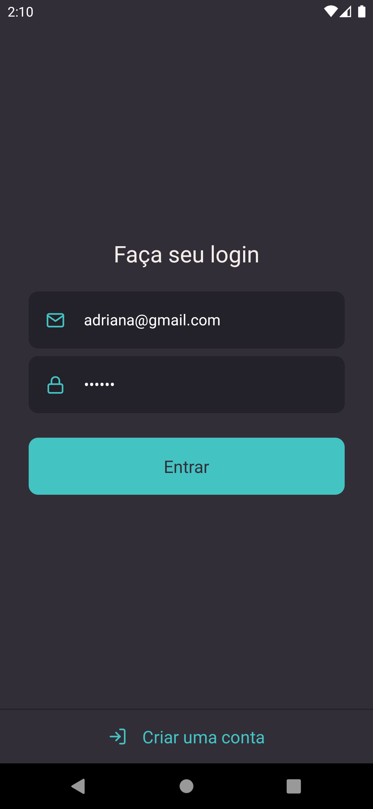
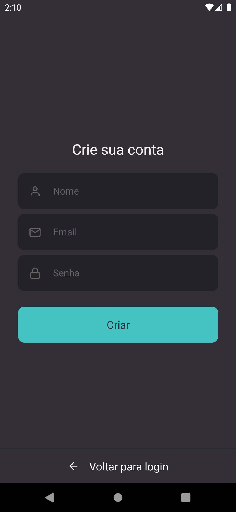
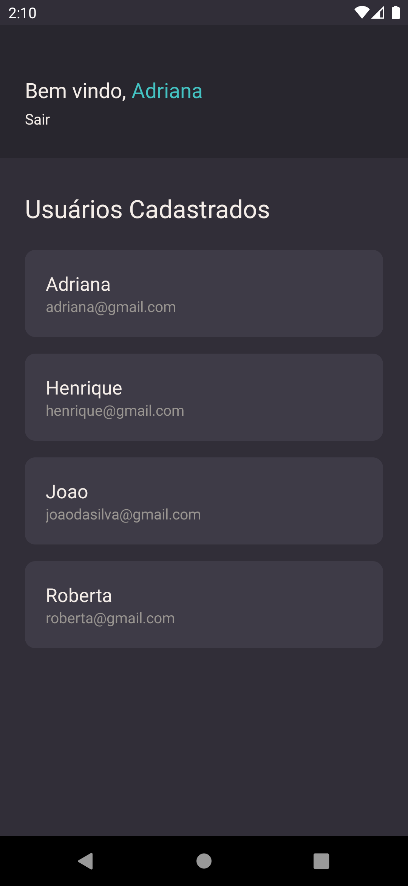
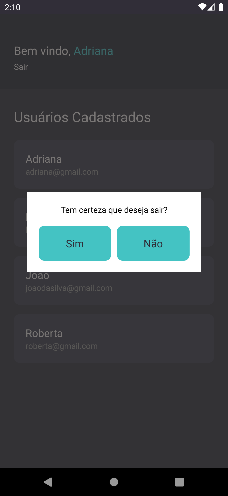

<div align="center" id="top">
  
</div>

<h1 align="center">fullstackapp</h1>

<p align="center">
  
  
  
  
</p>

<p align="center">
| - | - | - | - |
| |  |  |  |
</p>

## :sparkles: Features ##

:heavy_check_mark: Tela de Cadastro de Usuário com nome, email e senha;\
:heavy_check_mark: Tela de Login com validação de campos e autenticação de usuário;\
:heavy_check_mark: Tela de Listagem de usuários cadastrados;
:heavy_check_mark: Botão Sair com modal de confirmação para deslogar usuário;

## :rocket: Tecnologias ##

As seguintes ferramentas foram utilizadas neste projeto:

- [Expo](https://expo.io/)
- [Node.js](https://nodejs.org/en/)
- [React](https://pt-br.reactjs.org/)
- [React Native](https://reactnative.dev/)
- [TypeScript](https://www.typescriptlang.org/)


## :checkered_flag: Como rodar o projeto ##

**Você precisa do Android Studio instalado e configurado**

```bash
# Clone this project
$ git clone https://github.com/dxwebster/fullstackapp

# Access
$ cd fullstackapp

# Install dependencies
$ yarn

# Run the project
$ yarn android

```

## :memo: License ##

This project is under license from MIT. For more details, see the [LICENSE](LICENSE.md) file.


Made with :heart: by <a href="https://github.com/dxwebster" target="_blank">Adriana Shikasho</a>

&#xa0;

<a href="#top">Back to top</a>
